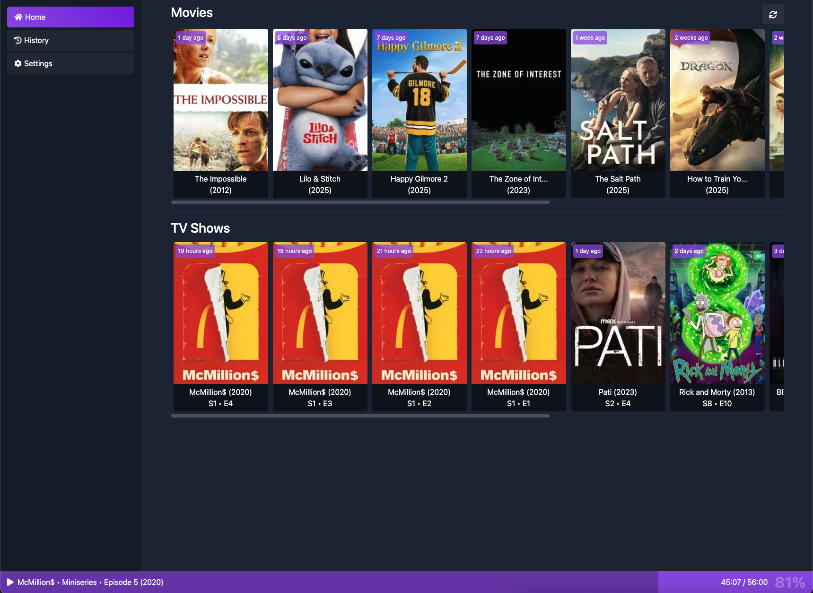

<p align="center">
  
</p>

<h1 align="center">Home App</h1>

<p align="center">
<a href="https://github.com/citr0s/home-app/actions/workflows/build.yml"></a>
<a href="https://github.com/citr0s/home-app/actions/workflows/deploy.yml"></a>
<a href="https://hub.docker.com/r/citr0s/home-app"></a>
<a href="https://hub.docker.com/r/citr0s/home-app"></a>
<a href="https://hub.docker.com/r/citr0s/home-app"></a>
</p>

---

<h4 align="center">Home App is a self-hosted web app designed to provide you with better dashboard for a homelab.</h4>

---

> [!WARNING]
> The app is still actively in development. Only latest release is available.
> Once stable, a release tag will be made available.

---

<p align="center">
  
</p>

---

## 🛠️ Installation

> [!NOTE]
> To run this application, you'll need [Docker](https://docs.docker.com/engine/install/) with [docker-compose](https://docs.docker.com/compose/install/).

Start off by showing some ❤️ and give this repo a star. Then from your command line:

```bash
# Create a new directory
> mkdir home-app
> cd home-app

# Create docker-compose.yml and copy the example contents into it
> touch docker-compose.yml
> nano docker-compose.yml
```

### docker-compose.yml

```yml
services:
    home-app:
        image: citr0s/home-app
        ports:
            - '82:80'
        environment:
            - ASPNETCORE_ENVIRONMENT=Production
            - ASPNETCORE_URLS=http://+:80
        volumes:
            - ./assets:/web-api/app/assets
```

---

## 💡 Feature request?

For any feedback, help or feature requests, please [open a new issue](https://github.com/citr0s/home-app/issues/new/choose).
Before you do, please read [the wiki](https://github.com/citr0s/home-app/wiki). The question you have might be answered over there.